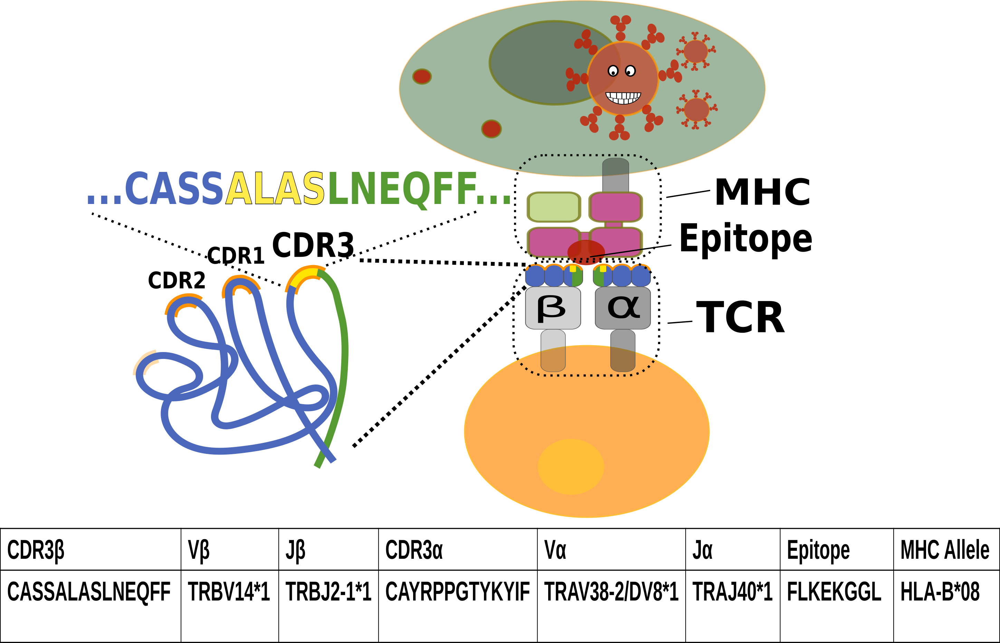

# EPIC-TRACE: predicting TCR binding to unseen epitopes using attention and contextualized embeddings
https://doi.org/10.1101/2023.06.26.546489

### Installation
1. install pyhton 3.8
2. run init.sh

 OR

2.1 python3.8 -m venv epictrace_venv \
2.2 source epictrace_venv/bin/activate\
2.3 pip install -r requirements.txt
### Data 
see example_data.csv for format\
### Train
Train with default parameters (optimized for Unseen epitope task) \
-g=1 for GPU\
-v versioncode\
specify \
-l 21 --collate one_hot (for one hot)\
OR\
-i <embeddings_file>.bin (to use embeddings)\
--train <traindata_file>.csv or <traindata_file>.gz\
--val <valdata_file>.csv or <valdata_file>.gz\
--test <testdata_file>.csv or <testdata_file>.gz\

    python src/train.py XXX --max_epochs=80 -g=1 -v=123456 -l 21 --collate one_hot --test_task 2 --train  <traindata_file>.gz --val <valdata_file>.gz --test <testdata_file>.gz

### Pretrained models and embedding dicts and data
https://www.dropbox.com/sh/jffr1q5wi9wgxl7/AABC_f6erKxZzjA-MlQuoCpga?dl=0

### Predict

    python src/test_results.py <5 first digits of versioncode> --runs <last digit or list of last digits> --save_preds --SWA --SWA_run _c0.001_1_20_01 --dataset <path to data> --pred_save_path <predictionssavepath.csv>

further examples are in scripts/runEPICTrace.sh

